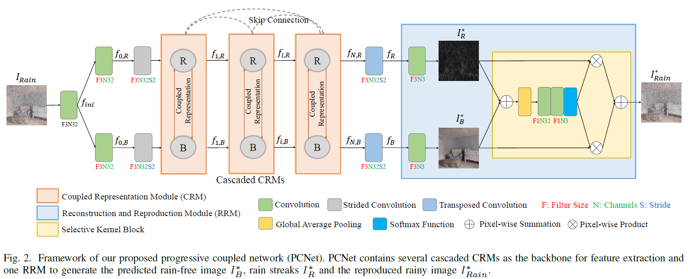
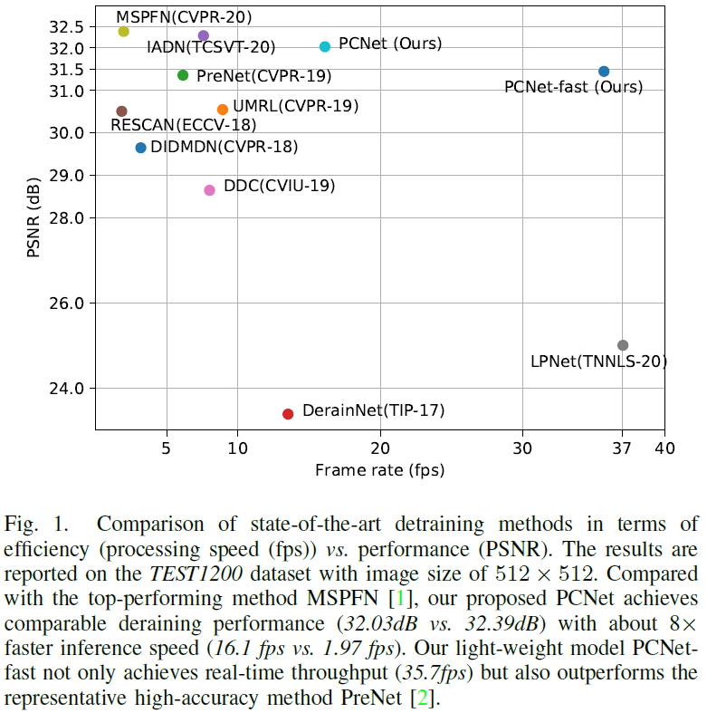
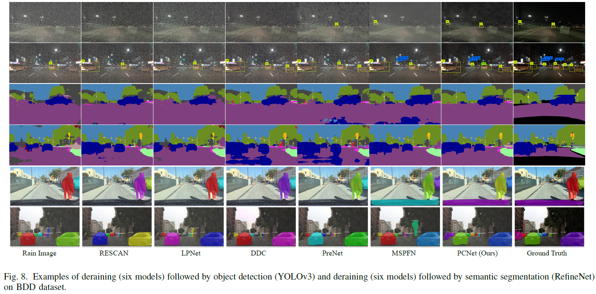

# Rain-free and Residue Hand-in-Hand: A Progressive Coupled Network for Real-Time Image Deraining (TIP 2021)

[Kui Jiang](https://scholar.google.com/citations?user=AbOLE9QAAAAJ&hl), [Zhongyuan Wang](https://dblp.org/pid/84/6394.html), [Peng Yi](https://dblp.org/pid/98/1202.html), [Chen Chen](https://scholar.google.com/citations?user=TuEwcZ0AAAAJ&hl=zh-CN), [Zheng Wang](https://scholar.google.com/citations?user=-WHTbpUAAAAJ&hl=zh-CN), [Xiao Wang](https://dblp.org/pid/49/67.html), [Junjun Jiang](https://scholar.google.com/citations?user=WNH2_rgAAAAJ&hl=zh-CN), and [Chia-Wen Lin](https://scholar.google.com/citations?user=fXN3dl0AAAAJ&hl=zh-CN)

**Paper**: [Rain-free and Residue Hand-in-Hand: A Progressive Coupled Network for Real-Time Image Deraining](https://www.researchgate.net/publication/353620456_Rain-free_and_Residue_Hand-in-Hand_A_Progressive_Coupled_Network_for_Real-Time_Image_Deraining)


> **Abstract:** *Rainy weather is a challenge for many vision-oriented tasks (e.g., object detection and segmentation), which causes performance degradation. Image deraining is an effective solution to avoid performance drop of downstream vision tasks. However, most existing deraining methods either fail to produce satisfactory restoration results or cost too much computation. In this work, considering both effectiveness and efficiency of image deraining,  we propose a progressive coupled network (PCNet) to well separate rain streaks  while preserving rain-free details. To this end, we investigate the blending correlations between them and particularly devise a novel coupled representation module (CRM) to learn the joint features and the blending correlations. By cascading multiple CRMs, PCNet extracts the hierarchical features of multi-scale rain streaks, and separates the rain-free content and rain streaks progressively. To promote computation efficiency, we employ depth-wise separable convolutions and a U-shaped structure, and construct CRM in an asymmetric architecture to reduce model parameters and memory footprint. Extensive experiments are conducted to evaluate the efficacy  of the proposed PCNet in two aspects: (1) image deraining on several synthetic and real-world rain datasets and (2) joint image deraining and downstream vision tasks (\textit{e.g.}, object detection and segmentation). Furthermore, we show that the proposed CRM can be easily adopted to similar image restoration tasks including image dehazing and low-light enhancement with competitive performance. The source code is available at https://github.com/kuijiang0802/PCNet.* 

## Network Architecture
<table>
  <tr>
    <td>  </td>
    <td>  </td>
  </tr>
</table>

## Results
<p align="center">
  
</p>
<p align="center">
  
</p>

## Installation
The model is built in PyTorch 1.1.0 and tested on Ubuntu 16.04 environment (Python3.7, CUDA9.0, cuDNN7.5).

For installing, follow these intructions
```
conda create -n pytorch1 python=3.7
conda activate pytorch1
conda install pytorch=1.1 torchvision=0.3 cudatoolkit=9.0 -c pytorch
pip install matplotlib scikit-image opencv-python yacs joblib natsort h5py tqdm
```

Install warmup scheduler

```
cd pytorch-gradual-warmup-lr; python setup.py install; cd ..
```

## Quick Test

To test the pre-trained deraining model on your own images, run 
```
python test.py  
```

## Training and Evaluation

Training and Testing codes for deraining are provided in their respective directories.

## Results
Experiments are performed for different image processing tasks including, image deraining, image dehazing and low-light image enhancement.

## Acknowledgement
Code borrows from [MPRNet](https://github.com/swz30/MPRNet) by [Syed Waqas Zamir](https://scholar.google.es/citations?user=WNGPkVQAAAAJ&hl=en). Thanks for sharing !

## Citation
If you use PCNet, please consider citing:

    @article{jiangpcnet,
        title={Rain-free and Residue Hand-in-Hand: A Progressive Coupled Network for Real-Time Image Deraining},
        author={Kui Jiang and Zhongyuan Wang and Peng Yi and Chen Chen and Zheng Wang and Xiao Wang and Junjun Jiang and Chia-Wen Lin},
        journal={IEEE Trans. Image Process.}, 
        year={2021}
    }

## Contact
Should you have any question, please contact Kui Jiang (kuijiang@whu.edu.cn)
